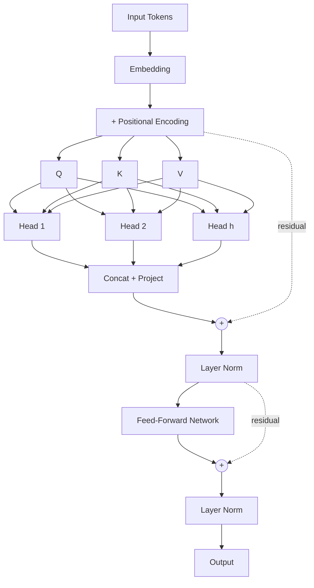

## Self-Attention Mechanism

The key innovation of transformers is the **self-attention mechanism**. Given an input sequence, self-attention computes a weighted sum of all positions, where the weights are determined by the compatibility of each pair of positions.

For an input matrix $X \in \mathbb{R}^{n \times d}$, we compute queries, keys, and values:

$$
Q = XW^Q, \quad K = XW^K, \quad V = XW^V
$$

The attention output is then:

$$
\text{Attention}(Q, K, V) = \text{softmax}\left(\frac{QK^T}{\sqrt{d_k}}\right)V
$$

The $\sqrt{d_k}$ scaling factor prevents the dot products from growing too large, which would push the softmax into regions with extremely small gradients.

## Multi-Head Attention

Rather than performing a single attention function, transformers use **multi-head attention** to jointly attend to information from different representation subspaces:

$$
\text{MultiHead}(Q, K, V) = \text{Concat}(\text{head}_1, \ldots, \text{head}_h)W^O
$$

where each head is computed as:

$$
\text{head}_i = \text{Attention}(QW_i^Q, KW_i^K, VW_i^V)
$$

## Implementation

Here's a minimal PyTorch implementation of scaled dot-product attention:

```python
import torch
import torch.nn.functional as F

def scaled_dot_product_attention(Q, K, V, mask=None):
    d_k = Q.size(-1)
    scores = torch.matmul(Q, K.transpose(-2, -1)) / d_k ** 0.5

    if mask is not None:
        scores = scores.masked_fill(mask == 0, float('-inf'))

    weights = F.softmax(scores, dim=-1)
    return torch.matmul(weights, V)
```

## Architecture Overview



## Positional Encoding

Since transformers have no inherent notion of position, we add positional encodings to the input embeddings. The original paper uses sinusoidal functions:

$$
PE_{(pos, 2i)} = \sin\left(\frac{pos}{10000^{2i/d}}\right)
$$

$$
PE_{(pos, 2i+1)} = \cos\left(\frac{pos}{10000^{2i/d}}\right)
$$

> The beauty of this encoding is that it allows the model to learn relative positions, since $PE_{pos+k}$ can be represented as a linear function of $PE_{pos}$.

## Key Takeaways

1. Self-attention has $O(n^2)$ complexity with sequence length
2. Multi-head attention allows the model to focus on different aspects simultaneously
3. Positional encodings inject sequence order information
4. Layer normalization and residual connections are critical for training stability

---

*This post is a simplified walkthrough. For the full details, see [Vaswani et al., 2017](https://arxiv.org/abs/1706.03762).*
